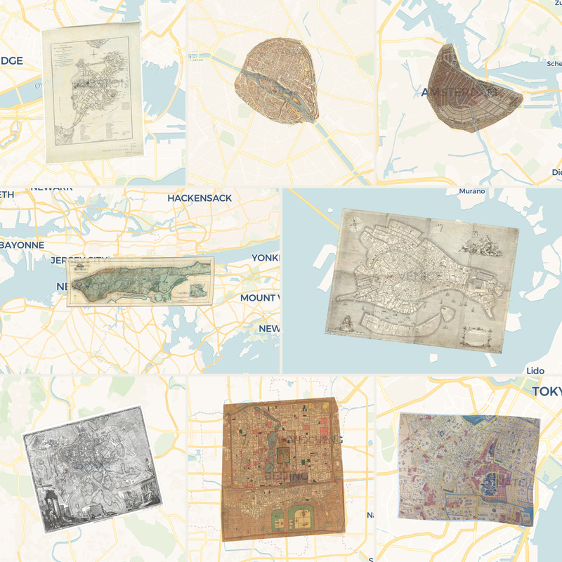

# Old Maps

Historical maps for the deck.gl [BitmapLayer example](https://deck.gl/examples/bitmap-layer).

Each image is a scanned map georeferenced by the community on [Map Warper](https://mapwarper.net), downloaded once as a warped Web Mercator (EPSG:3857) image covering the map's bounding box, at up to 4096px on the long side (close to native scan resolution), and converted to WebP. Files are named by Map Warper map id.

There are two exceptions. `17575.webp` (Peking): its Map Warper control points only cover a narrow strip down the middle of the scan, so the 2nd-order polynomial warp Map Warper applied bends the map badly towards its edges. That warp was undone and the image re-warped with an affine fit of the same control points (excluding one ~110 m outlier), which lines up with the modern basemap to within about 35 m RMS.

`21028.webp` (Edo): it has only four Map Warper control points, bunched together around Zōjō-ji, and the affine warp they give makes the map about 40% too small, so the edges miss by several hundred metres. Like other Edo *kiri-e-zu*, the map is also drawn at different scales in different areas. Map Warper's warped image was re-warped with a smoothed thin-plate spline through 16 new control points on landmarks that survive today: temples and shrines (Zōjō-ji, Atago, Tentoku-ji, Seishō-ji, Konchi-in, Kensō-ji), the Furukawa bridges, and daimyō estates (Kishū = Kyu-Shiba-rikyu, Chōfu and Chōshū Mōri = Roppongi Hills and Tokyo Midtown). Leave-one-out error is about 55 m.

| File | Map | Bounds [west, south, east, north] | Original source |
| --- | --- | --- | --- |
| `85408.webp` | [Boston, 1775](https://mapwarper.net/maps/85408) | -71.0828189, 42.3335189, -71.0395962, 42.3774796 | Unknown |
| `36301.webp` | [Sanitary & Topographical Map of the City and Island of New York, Egbert L. Viele, 1865](https://mapwarper.net/maps/36301) | -74.0582527, 40.6815339, -73.8768911, 40.8692384 | Unknown |
| `76690.webp` | [La ville, cité et Université de Paris, Olivier Truschet & Germain Hoyau, c. 1550](https://mapwarper.net/maps/76690) | 2.3246531, 48.8295901, 2.3806617, 48.8747828 | Unknown |
| `73718.webp` | [Amsterdam, Daniel Stalpaert & Nicolaes Visscher, mid-17th century](https://mapwarper.net/maps/73718) | 4.8545034, 52.3464006, 4.945947, 52.3980841 | Unknown |
| `76801.webp` | [Iconografica rappresentatione della inclita città di Venezia, Lodovico Ughi, 1729](https://mapwarper.net/maps/76801) | 12.3058565, 45.4199097, 12.3662522, 45.4515513 | Unknown |
| `9175.webp` | [Nuova pianta di Roma, Giambattista Nolli, 1748](https://mapwarper.net/maps/9175) | 12.4413659, 41.8626281, 12.5268237, 41.9211831 | Unknown |
| `17575.webp` | [Peking, 1914](https://mapwarper.net/maps/17575) | 116.3392079, 39.8654237, 116.4388368, 39.9517812 | Unknown |
| `21028.webp` | [Central Edo (Tokyo), 1858](https://mapwarper.net/maps/21028) | 139.724641, 35.6486265, 139.7614962, 35.6722775 | Unknown |
